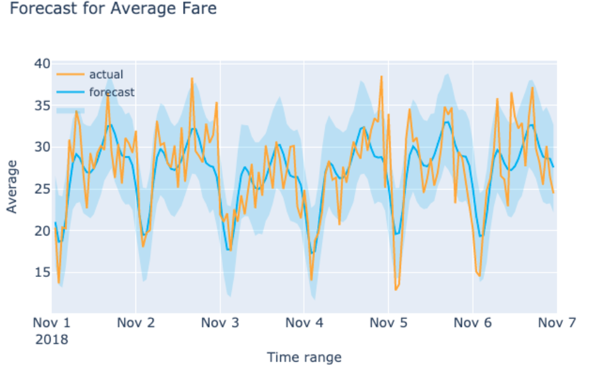

# NYC Yellow Taxi Forecasts

#### Time series forecasting project for prediction of NYC yellow taxi pick-up demand, fares, trip distance and tips for the drivers

[Link to detailed presentation on Google Slides](https://docs.google.com/presentation/d/1VB7F82okO_C_BSdAJD7PlY08mFHoK2Uxnn3M9ZTIvH4/edit#slide=id.ge9090756a_2_12)

Created a dashboard for a taxi company with statistics and forecasts regarding taxi rides

+ Gathered over 100 million data points about NYC yellow taxi pickups in whole 2018
+ Utilized Dask for the parallelization of computing on Google Cloud 
+ Created forecasting models for predicting taxi pickup demand, fare, average trip distance and tips for the drivers
+ Built an interactive dashboard with running forecasts based on user input

    
## Project description
    
In this project I wanted to build a dashboard for the taxi company with statistics regarding the rides and forecasts of:

- taxi pickup demand
- average fare
- trip distance
- tips for the drivers (as a ratio of total price for the ride)

To prepare such dashboard I gathered information about New York City Yellow Taxi rides in whole 2018 resulting in over 100 million datapoints. To handle big amount of data points I utilized Dask and PySpark for the parallelization of computing on Google Cloud. 

Forecasts were performed with the use of Facebook Prophet model. For choosing best performing model time-series cross-validation approach was implemented.

Additionally weather information ([NOAA](https://www.ncdc.noaa.gov/cdo-web/search)) and CityBike demand data ([CityBike NYC](https://www.citibikenyc.com/system-data)) were added to improve the accuracy of the predictions.

**Jupyter notebooks summary**:

1. EDA\_for_2018-01.ipynb - First exploration of the dataset
2. Gathering-taxi-data-Preparing-dataset.ipynb - gathering data, subsetting dataset, converting to parquet files
3. Exogenous_variables.ipynb - feature engineering, getting weather and CityBike data
4. NYC-time-series-modeling-Sarima.ipynb - first taxi pickup demand forecast using ARIMA models
5. NYC-time-series-modeling-FBProphet.ipynb - forecasts of demand, fares, tips and trip distance using Facebook Prophet models
6. Neighborhood\_data_conversion.ipynb - extracting hourly data for each neighborhood
7. Borough_forecasts.ipynb - forecast for each borough
8. Neighborhood-demand-forecasts.ipynb - demand forecasts for 103 neighborhoods
9. Predictions.ipynb - loading models and running predictions
   - streamlit_v1.py - visualization dashboard running in Streamlit 

### Exploratory Data Analysis

Data about the rides were gathered from the [NYC Open Data](https://opendata.cityofnewyork.us/) website together with the information about the taxi zones in NYC. Dataset consists of over 100 milion of NYC yellow taxi pickup information from the whole year of 2018. Most of the calculations were done on Google Cloud with the use of Dask and PySpark for the parallelization of computing. 

On the graph below you can see an example of taxi pickup demand for one month. The daily and weekly seasonality of the datapoint is noticable and this information was used for running predictive models.

Map chart below visualize the distribution of total count of yellow taxi pickups in 2018. You can see that Manhattan is the borough with highest number of taxi users. The neiighborhood with highest amount of rides was Upper East Side. It can be the result of the lowest amount of Subway lines on Manhattan in this area and the specificity of the locals. 

Other locations that clearly have the most users are the airports - LaGuardia and JFK - both of them had over 2.5 million taxi pickups in 2018.

Following pie charts shows that most of the rides where initiated on Manhattan and that their weekday distribution is quite even.

We can also notice that the demand for the taxi rides is the lowest during early morning hours (3-6AM) and highest in the evening (5-9 PM). The trip distance that people are traveling at same time frames is inversely proportional to demand.

Pickup demand   | Trip distance
:-------------------------:|:-------------------------:
 |

Looking further to the specificity of each borough we can see that people at Manhattan tend to travel much lower distances than in other boroughs but also tip the drivers proportionally more.

   |
:-------------------------:|:-------------------------:   
 | 

In this project I decided to go down to the level of single neighborhoods. Looking at the plots below we can understand how each area is different from others and from the whole borough on average and what are the busy days in the location.

   |
:-------------------------:|:-------------------------:   
 | 

### Forecasting modeling

#### NYC level
First part of the project was focused on preparing forecasts of:
- taxi pickup demand
- average fare
- trip distance
- tips for the drivers 
for the whole NYC area in general.

After gathering all the data, they were preprocessed to get average hourly values. Those informations were used for modeling time series predictions.

I decidec to try using two different approaches - Autoregressive Integrated Moving Average model and Facebook Prophet model. This model is a combination of three different forecasting algorithms responsible for capturing trends in time, seasonality and additional regressors impacting time series, such as holidays and one-time events.

<!---->
 

After running multiple models I decided to stay with Facebook Prophet modeling instead of ARIMA because it was not doing well with predicting the seasonal trends and SARIMA model, after stationarizing data, was giving similar results to Prophet but computation time was much higher.

First version of models used grouped date for whole NYC area and implemeting only seasonality to the model. Next step was to add exogenous variables to improve accuracy for each prediction. 

<!---->
 

All Facebook Prophet Models were run with holidays and best performing subset of exogenous variables. Adding exogenous variables helped in improving predictions for NYC by following values: 

Pickup demand | Fare amount   | Trip distance| Tip ratio
------------- | ------------- |------------- | -------------
    -10%      |    -2%        |     -5%      |    -20%

On the chart below you can see a predicted and actual taxi pickup demand in NYC in November 2018.

<!---->
 

#### Borough level

After getting model for NYC, data was then grouped into boroughs to make prediction on more specific level. Staten Island pickups were not 
taken into account as there was too little taxi pickups in total. This step resulted in 4 different forecasting model per borough - 16 models in total. Each of them consisted of a subset of exogenous variables, which had the lowest average RMSE after cross-validation.

Manhattan   | Queens
:-------------------------:|:-------------------------:
 |

Brooklyn   | Bronx
:-------------------------:|:-------------------------:
 |

#### Neighborhood level

Last iteration of building forecasting models was to predict the demand at the level of a neighborhood. For locations with lowest taxi demand closest taxi zones were grouped together. This process resulted in 58 neighborhoods for Manhattan, 21 locations at Brooklyn and 24 at Queens.
Models were fit with the demand information for each of the locations seperately to get the best prediction.

East Village   | Astoria
:-------------------------:|:-------------------------:
 |

    
At the end all models were fit to data from January to end of October 2018 - November and December data were used for a final evaluation.

### Interactive dashboard
    
Streamlit visualization tool was used to build an interactive dashboard. On the page user can choose between different tabs. 

1. Overview of the project - short description of dataset and approach. 
2. Visualization of the data set with the map and different statistical information about taxi rides
3. Running predictions of demand, fare, trip distance and tips at the level of borough. User can choose the location and date to run the forecast.
4. Demand predictions at the level of neighborhood for Manhattan, Brooklyn and Queens locations.